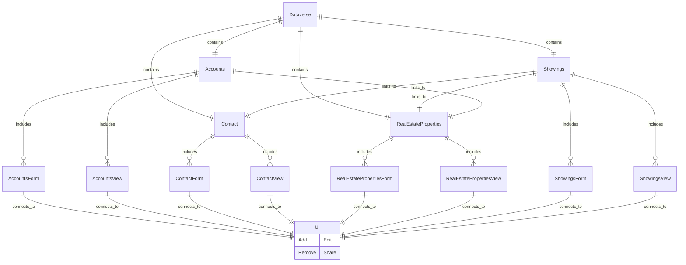
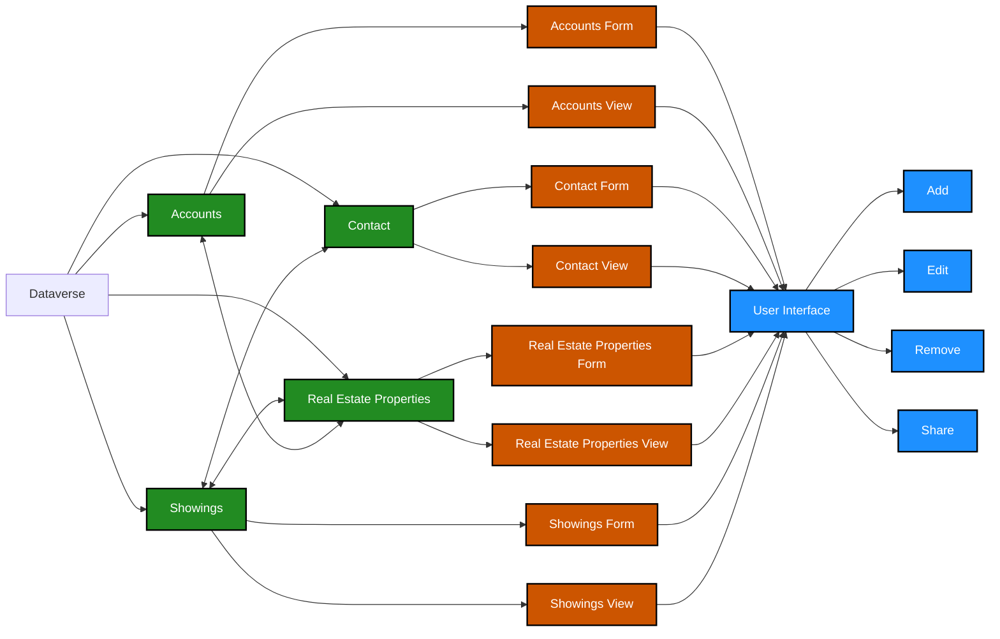

# Contoso Real Estate App: Property Management

## Table of Contents
1. [Introduction](#introduction)
2. [Functionalities](#functionalities)
3. [Architecture and Data Model](#architecture-and-data-model)
4. [User Interface (UI) Development](#user-interface-ui-development)
5. [Workflow and Processes](#workflow-and-processes)
6. [Status Tracking and Business Rules](#status-tracking-and-business-rules)
7. [Challenges and Solutions](#challenges-and-solutions)
8. [Potential Improvements](#potential-improvements)
9. [Conclusion](#conclusion)

---

## Introduction

The Property Management app is a model-driven application built using Microsoft Power Apps and Dataverse. It provides a centralized platform for managing real estate properties, showings, clients, and accounts. This application streamlines the process of capturing, displaying, and organizing real estate data, enabling efficient property management and client interaction.

The link to the app:

https://shorturl.at/Eq3R8

---

## Functionalities
- **Manage Real Estate Properties**: 
  - Add, update, and view property details, including address, asking price, and property features.
- **Track Showings**: 
  - Record showing details, including dates, attendees, agents, and client interest levels.
- **Client Management**: 
  - Capture and organize client information through the `Contacts` table.
- **Account Management**: 
  - Maintain information about real estate accounts and their primary contacts.
- **Centralized Operations**: 
  - A single platform to manage property listings, customer details, and showing schedules.

---

## Architecture and Data Model
- **Data Model Overview**:
  The app is structured using Dataverse-based tables with custom columns designed for real estate operations.
  

- Simplified Architechture and Data Model

- **Primary Tables**:
  1. **Real Estate Properties Table**:
     - Fields: Address, Asking Price, Bedrooms, Bathrooms.
     - Views: Display active properties details in a list for easy browsing.
     - Forms: Provide detailed information about each property.
  2. **Showing Table**:
     - Fields: Showing Date, Shown To, Shown By, Property Shown, Comments, Client Interest Level, Client information.
     - Forms: Capture and display details about property showings.
  3. **Contacts Table**:
     - Fields: Client Name, Contact Information (email), Company Name, Business Phone Number.
     - Forms: Manage client data for better interaction and follow-up.
  4. **Accounts Table**:
     - Fields: Real Estate Account Name, Main Phone, Address,Primary Contact Info.
     - Forms: Maintain account-specific data.

- **Customizations**:
  - Custom columns in Dataverse to capture unique details for properties and showings.
  - Pre-configured views and forms tailored for property management.

---

## User Interface (UI) Development
- **Navigation and Layout**:
  - Organized sitemap with areas for Properties, Showings, Contacts, and Accounts.
  - Accessible views for browsing records in each table.
  
- **Forms**:
Allows users with appropriate security credentials to add new properties, new accounts, and new potential clients with necessary business information.
  - **Real Estate Properties Form**:
    - Includes address, asking price, bedrooms, bathrooms.
  - **Showing Form**:
    - Captures property shown, showing date, shown to, shown by, and client interest level.
  - **Contacts Form**:
    - Manages client names and contact information.
  - **Accounts Form**:
    - Displays account details and principal contact information.

---

## Workflow and Processes
- **Property Management**:
  - Add new properties and update existing records with ease.
- **Showing Scheduling and Tracking**:
  - Record showing schedules and monitor client responses.
- **Customer Relationship Management**:
  - Store and manage client preferences and communication details.
- **Account Management**:
  - Maintain real estate account records and primary contacts.

---

## Status Tracking and Business Rules
- **Status Indicators**:
  - Use field-level statuses to track showing outcomes and client interest.
- **Business Rules**:
  - Automatically categorize properties based on availability.
  - Notify agents if client interest reaches a predefined level.

---

## Challenges and Solutions
- **Challenge**: Managing diverse real estate data efficiently.
  - **Solution**: Implemented custom tables and columns in Dataverse for structured data capture.
- **Challenge**: Providing a user-friendly interface for non-technical users.
  - **Solution**: Designed intuitive forms and views to simplify data entry and browsing.

---

## Potential Improvements
- Integrate analytics dashboards for market trends and property performance.
- Incorporate automated reminders for scheduled showings and follow-ups.

---

## Conclusion
The Property Management app is a powerful tool for organizing and managing real estate operations. By leveraging the Dataverse and model-driven apps in Microsoft Power Apps, it offers a comprehensive solution for real estate professionals to streamline property management, showings, and client interactions. Future enhancements will continue to build on this foundation for even greater efficiency and functionality.

---

